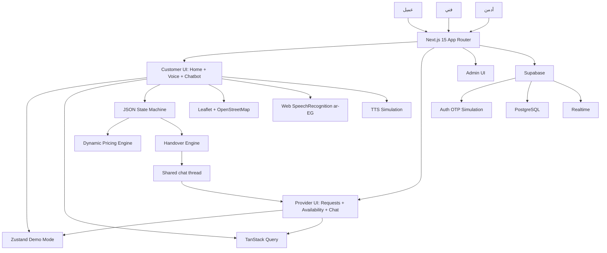

# 1) Project architecture diagram (Mermaid)

```mermaid
flowchart TD
  U[عميل] --> N[Next.js 15 App Router]
  P[فني] --> N
  A[أدمن] --> N

  N --> C1[Customer UI: Home + Voice + Chatbot]
  N --> C2[Provider UI: Requests + Availability + Chat]
  N --> C3[Admin UI]

  C1 --> Z[Zustand Demo Mode]
  C2 --> Z
  C1 --> Q[TanStack Query]
  C2 --> Q

  C1 --> SM[JSON State Machine]
  SM --> PE[Dynamic Pricing Engine]
  SM --> HF[Handover Engine]

  N --> S[Supabase]
  S --> SA[Auth OTP Simulation]
  S --> SP[PostgreSQL]
  S --> SR[Realtime]

  C1 --> M[Leaflet + OpenStreetMap]
  C1 --> V[Web SpeechRecognition ar-EG]
  C1 --> TTS[TTS Simulation]

  HF --> CH[Shared chat thread]
  CH --> C2
```
